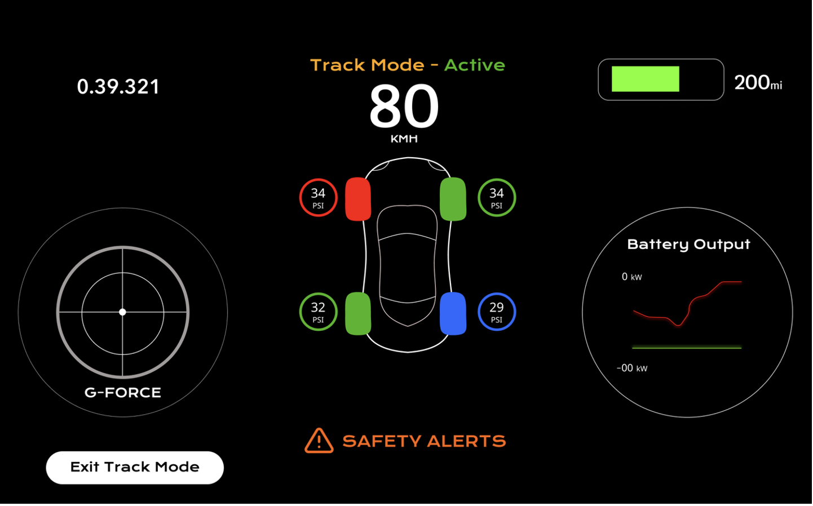

# 3.1
A standard Android or Apple car infotainment system is designed as a general purpose interface for navigation, media, and convenience features. These systems can prioritise aesthetics and richer interaction patterns because everyday driving allows for slower response times and higher tolerance for glitches.

A race car interface is fundamentally different. It must deliver performance critical data such as motor temperature, speed, g-force and battery health with extremely low latency, often refreshing well under 100 ms. Any delay or UI freeze can lead to slower driver reactions at high speeds. The cognitive load on a race driver is also far higher; there is no time to navigate menus or interpret complex visuals. This requires a simplified, predictable layout with minimal animations or interaction steps.

Race conditions also introduce harsh physical and electrical environments. The system must remain stable under vibration, temperature extremes, sensor noise, and partial telemetry dropouts. Unlike consumer apps that rely on consistent network conditions, race telemetry may arrive late, corrupted, or incomplete, and the interface must continue operating safely without showing misleading values.

# 3.2
1. Minimal Driver Distraction
The UI must be simple, stable, and readable at a glance to minimise cognitive effort. Avoiding clutter, animations, or unnecessary metrics ensures the driver can interpret information in under a second.
What could go wrong: A driver searching the screen could miss a braking point or react too late to a hazard.

2. Prioritisation of Critical Information
Essential metrics like temperature warnings or speed must be visually dominant, while secondary details are deprioritised.
What could go wrong: If a motor temperature warning is buried in the UI, the driver may miss it, risking mechanical failure or race withdrawal.

3. Robust Handling of Corrupted or Partial Data
Telemetry may drop or arrive corrupted, so the system should clamp or hold the last known good values instead of displaying impossible numbers.
What could go wrong: Sudden spikes like “300 km/h” may distract the driver or cause unnecessary panic.

4. Predictability and Fail-Safe Behaviour
The interface should behave consistently the same colours, positions, and alert patterns and degrade gracefully during full telemetry loss with a clear “Signal Lost” state.
What could go wrong: An unpredictable layout or colour change can overload the driver and delay recognition of warnings.

# 3.3
Testing must replicate both software stress and real racing conditions. High frequency telemetry tests flood the UI with rapid data updates to ensure it stays responsive without jitter or freezes. Network simulations introduce packet loss, delays, corrupted values, and full dropouts to verify that the UI degrades safely and avoids displaying misleading numbers.

Environmental testing exposes the system to vibration, heat, cold, and glare to confirm that the hardware and visuals remain stable in a race environment. Long-duration runs help detect memory leaks, rendering spikes, or gradual performance degradation by monitoring CPU/GPU load and frame rates.

Driver centric testing evaluates readability under motion and lighting changes, ensuring critical alerts can be recognised instantly. Reaction time checks confirm the UI supports quick decisions without adding cognitive load. Fault detection and logging are also validated, ensuring telemetry anomalies or sensor failures are captured accurately for engineers.

Finally, on vehicle testing during practice runs exposes the interface to real acceleration, bumps, and steering vibration, verifying that the UI and telemetry pipeline remain reliable in the conditions where driver safety depends on them.

#TrackMode
